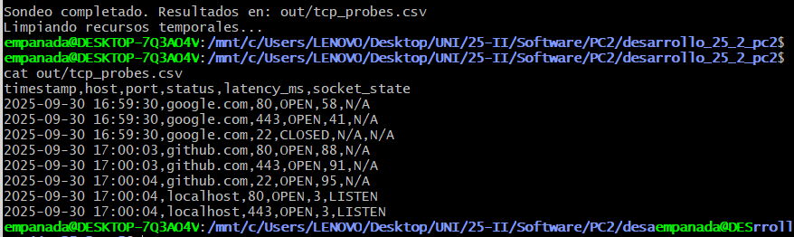

# Bitácora Sprint 1 - TCP Probes

**Responsable:** [Ariana Mercado]  
**Fecha:** 29 de septiembre de 2025  
**Rama:** rama/ariana1

## Comandos Ejecutados

### Verificación de herramientas
```bash
$ which nc ss bats
/usr/bin/nc
/usr/bin/ss
/usr/bin/bats
```

### Configuracion de herramientas
```
$ git checkout -b rama/alumno1
$ mkdir -p src tests out docs
$ chmod +x src/probe_tcp.sh
```
### Ejecucion del proyecto
```
$ make tools
Verificando herramientas... ✓

$ make build
Preparando directorio de salida... ✓

$ make run
Sondeo completado. Resultados en: out/tcp_probes.csv

$ make test
bats tests/
 ✓ probe_tcp.sh debe generar CSV con headers correctos
 ✓ puerto abierto debe reportar status OPEN
2 tests, 0 failures
```
### Salidas relevantes



