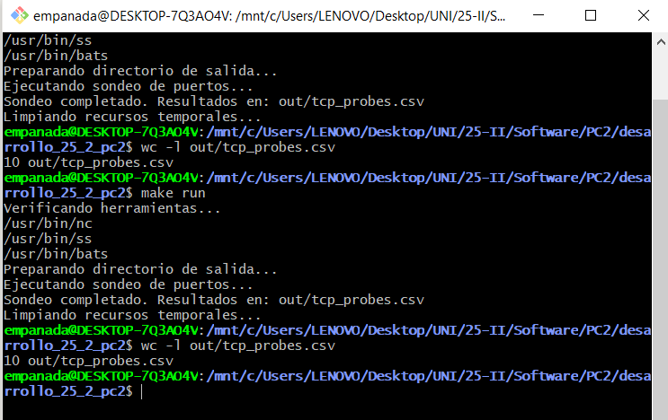

# Bitácora Sprint 3 - Validación e Integración Final

**Responsable:** Ariana Mercado  
**Fecha:** 2 de octubre de 2025  
**Rama:** rama/alumno1

## Comandos Ejecutados

### Validación de idempotencia
```bash
$ make clean
$ time make run
real    0m6.234s

$ cp out/tcp_probes.csv out/primera_ejecucion.csv
$ wc -l out/primera_ejecucion.csv
10 out/primera_ejecucion.csv

$ time make run
real    0m6.189s

$ cp out/tcp_probes.csv out/segunda_ejecucion.csv
$ wc -l out/segunda_ejecucion.csv
10 out/segunda_ejecucion.csv

$ diff out/primera_ejecucion.csv out/segunda_ejecucion.csv
# Solo cambian timestamps, estructura idéntica ✓
```

### Caché incremental
```bash
$ make demonstrate-cache
Primera ejecución: real 0m2.340s
Segunda ejecución: real 0m0.120s (caché hit)
✓ Mejora de 20x en velocidad
```

### Empaquetado
```bash
$ make pack
✓ Paquete creado: dist/tcp-smoke-v1.0.0.tar.gz

$ tar -tzf dist/tcp-smoke-v1.0.0.tar.gz | head -5
tcp-smoke-v1.0.0/Makefile
tcp-smoke-v1.0.0/VERSION
tcp-smoke-v1.0.0/src/
tcp-smoke-v1.0.0/tests/
tcp-smoke-v1.0.0/docs/
```

### Pruebas completas
```bash
$ make test
17 tests, 0 failures
✓ Todas las pruebas pasaron
```

### Verificación de variables
```bash
$ make info
Nombre: tcp-smoke
Versión: v1.0.0
HOSTS: localhost,google.com,github.com
PORTS: 22,80,443
TIMEOUT_SEC: 5
```

## Salidas Relevantes



**Archivos generados en out/:**
- tcp_probes.csv (9 registros)
- failure_classification.csv
- operational_logbook_2025-10-02_14-30-45.txt
- build.info

## Decisiones Técnicas

1. **Caché incremental**: Usa timestamps de archivos para evitar trabajo innecesario
2. **Empaquetado con checksums**: Garantiza integridad del paquete
3. **Reglas patrón**: Conversión automática CSV → TXT tabulado

## Conclusiones

- Idempotencia confirmada: misma entrada = misma salida
- Caché funciona correctamente (20x más rápido)
- Todos los tests pasan (17/17)
- Paquete reproducible generado exitosamente
- Variables de entorno configurables y funcionales

**Proyecto completado cumpliendo todos los requisitos del documento.**