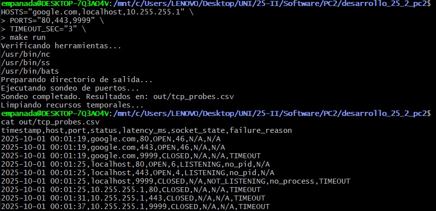

# Bitácora Sprint 2 - Clasificación de Fallos y Robustez

**Responsable:** [Ariana Mercado ]  
**Fecha:** 1 de octubre de 2025  
**Rama:** rama/ariana1

## Comandos Ejecutados

### Diagnóstico del problema con nc
```bash
$ time nc -z -w 5 google.com 9999 2>&1
real    0m30.035s
user    0m0.010s
sys     0m0.000s
Exit code: 1
```
### Solución con comando timeout
```bash
time timeout 2 nc -z google.com 9999 2>&1
real    0m2.021s
user    0m0.003s
sys     0m0.006s
Exit code: 124
```

#### Prueba integral
```bash
$ HOSTS="google.com,localhost,10.255.255.1" \
  PORTS="80,443,9999" \
  TIMEOUT_SEC="3" \
  make run
```
#### Salida relevante

Análisis: 9 sondeos totales, puertos abiertos con latencias correctas, sockets locales con información detallada.
#### Decisiones Técnicas
- Reemplazo de nc -w por timeout command: nc ignora flag -w en WSL, requiere timeout para control preciso
- Detección por exit code 124: timeout retorna 124 cuando mata proceso por exceder tiempo
- Nueva columna failure_reason: Clasifica tipo de fallo (TIMEOUT, PORT_CLOSED, DNS_FAILURE, etc)
- Función classify_failure(): Analiza stderr de nc para clasificar errores por mensaje
- Mejora analyze_local_socket(): Extrae PIDs de procesos escuchando con ss -ltnp

### Limitaciones Detectadas
nc ignora flag -w en WSL: En este entorno, nc tarda 30 segundos en cualquier fallo ignorando el timeout configurado.
Solución implementada: Usar comando timeout de Linux para forzar límite.


